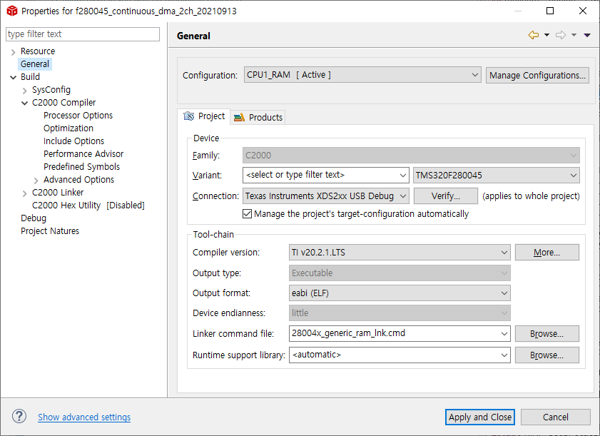

# f280045_DMA_ADC
> Using DMA for ADC monitoring

[![Build Status][travis-image]][travis-url]

EPWM2 trigger를 기준으로 ADC conversion을 시작함

ADCA, ADCC channel 12 each.

## IDE, Library Install URL
Windows

[IDE][ccs9_3-download], 
[Library][c2000ware-url]

## 사용 예제

ti\ .. \c2000\C2000Ware_3_04_00_00\driverlib\f28004x\examples\adc\adc_ex6_soc_continuous_dma.c

ti\ .. \c2000\C2000Ware_3_04_00_00\driverlib\f28004x\examples\adc\CCS\adc_ex6_soc_continuous_dma.projectspec를 CCS에서 Import해 사용

_더 많은 예제와 사용법은 [Wiki][wiki]를 참고하세요._

## 개발 환경 설정

Windows 10 개발환경의 `CCS 9.3.0`에서 `build, compile`

Linker command file setting 방법

Build command setting  방법

개발 PC의 CPU thread 수 만큼 -j 뒤에 기입해주면 됨
> ${CCS_UTILS_DIR}/bin/gmake -k -k12

## 업데이트 내역

* 0.2.1
    * 수정: 문서 업데이트 (모듈 코드 동일)
* 0.2.0
    * 수정: `setDefaultXYZ()` 메서드 제거
    * 추가: `init()` 메서드 추가
* 0.1.1
    * 버그 수정: `baz()` 메서드 호출 시 부팅되지 않는 현상 (@컨트리뷰터 감사합니다!)
* 0.1.0
    * 첫 출시
    * 수정: `foo()` 메서드 네이밍을 `bar()`로 수정
* 0.0.1
    * 작업 진행 중

<!-- 
## 정보

README Template by. sujinleeme

[sujinleeme](https://github.com/sujinleeme/readme-template/tree/master/korean) -->

## 기여 방법

1. (<https://github.com/yourname/yourproject/fork>)을 포크합니다.
2. (`git checkout -b feature/fooBar`) 명령어로 새 브랜치를 만드세요.
3. (`git commit -am 'Add some fooBar'`) 명령어로 커밋하세요.
4. (`git push origin feature/fooBar`) 명령어로 브랜치에 푸시하세요. 
5. 풀리퀘스트를 보내주세요.

<!-- Markdown link & img dfn's -->
[c2000ware-url]: https://www.ti.com/tool/C2000WARE
[ccs9_3-download]: https://software-dl.ti.com/ccs/esd/documents/ccs_downloads.html#code-composer-studio-version-9-downloads
[travis-image]: https://img.shields.io/travis/tlals96/f280045_DMA_ADC/master.svg?style=flat-square
[travis-url]: https://app.travis-ci.com/github/tlals96/f280045_DMA_ADC
[wiki]: https://github.com/yourname/yourproject/wiki
[general-setting]: https://https://img.shields.io/travis/tlals96/f280045_DMA_ADC/images/ccs_general_setting.png